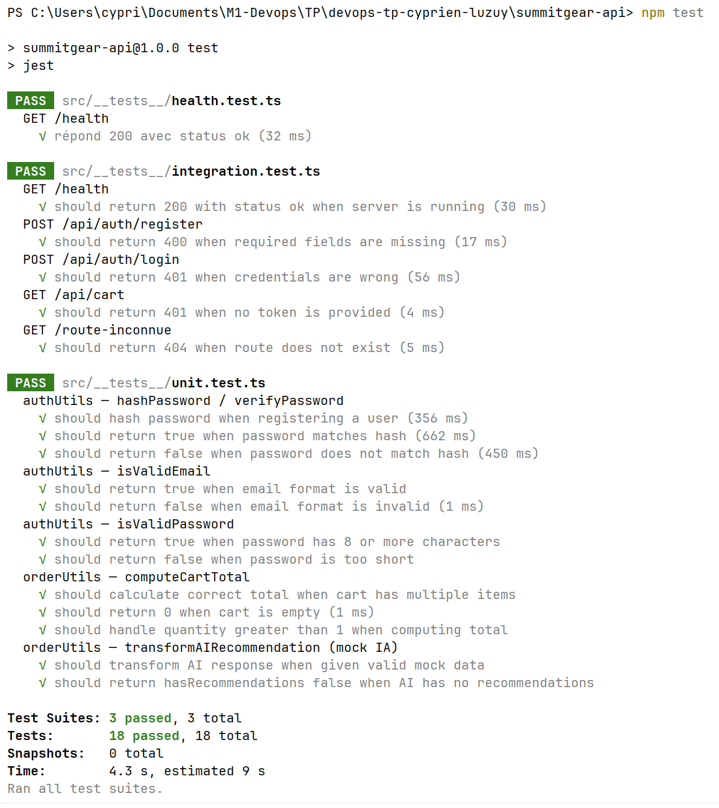

# Plan de tests — SummitGear API

## Fonctionnalités critiques identifiées

### 1. Authentification (register / login)

| Type | Cas de test |
|---|---|
| Unitaire | `should hash password when registering a user` |
| Unitaire | `should return false when password does not match hash` |
| Intégration | `should return 201 and token when POST /api/auth/register with valid data` |
| Intégration | `should return 401 when POST /api/auth/login with wrong password` |
| E2E (bonus) | Scénario complet : register → login → accès route protégée |

---

### 2. Validation des données entrantes

| Type | Cas de test |
|---|---|
| Unitaire | `should return true when email format is valid` |
| Unitaire | `should return false when email format is invalid` |
| Unitaire | `should return false when password is too short` |
| Intégration | `should return 400 when POST /api/auth/register with missing fields` |

---

### 3. Calcul du total de commande

| Type | Cas de test |
|---|---|
| Unitaire | `should calculate correct total when cart has multiple items` |
| Unitaire | `should return 0 when cart is empty` |
| Unitaire | `should handle quantity greater than 1 when computing total` |
| Intégration | `should return 400 when POST /api/orders with empty cart` |

---

## Résumé des cas de test

| # | Fonctionnalité | Type | Statut |
|---|---|---|---|
| 1 | Hash du mot de passe | Unitaire | ✅ |
| 2 | Vérification du mot de passe | Unitaire | ✅ |
| 3 | Validation format email | Unitaire | ✅ |
| 4 | Validation longueur mot de passe | Unitaire | ✅ |
| 5 | Calcul total panier | Unitaire | ✅ |
| 6 | Panier vide → total 0 | Unitaire | ✅ |
| 7 | Register route | Intégration | ✅ |
| 8 | Login échoué | Intégration | ✅ |
| 9 | Health check | Intégration | ✅ |

---

## Couverture de code

```
npm run test:coverage
```

> Rapport disponible dans `coverage/index.html` après exécution.


---

## Mock IA

Le test `orderUtils.test.ts` utilise un mock de la réponse IA pour tester la transformation
des données sans aucun appel réseau ni clé API.

## Capture de rapport T21 

